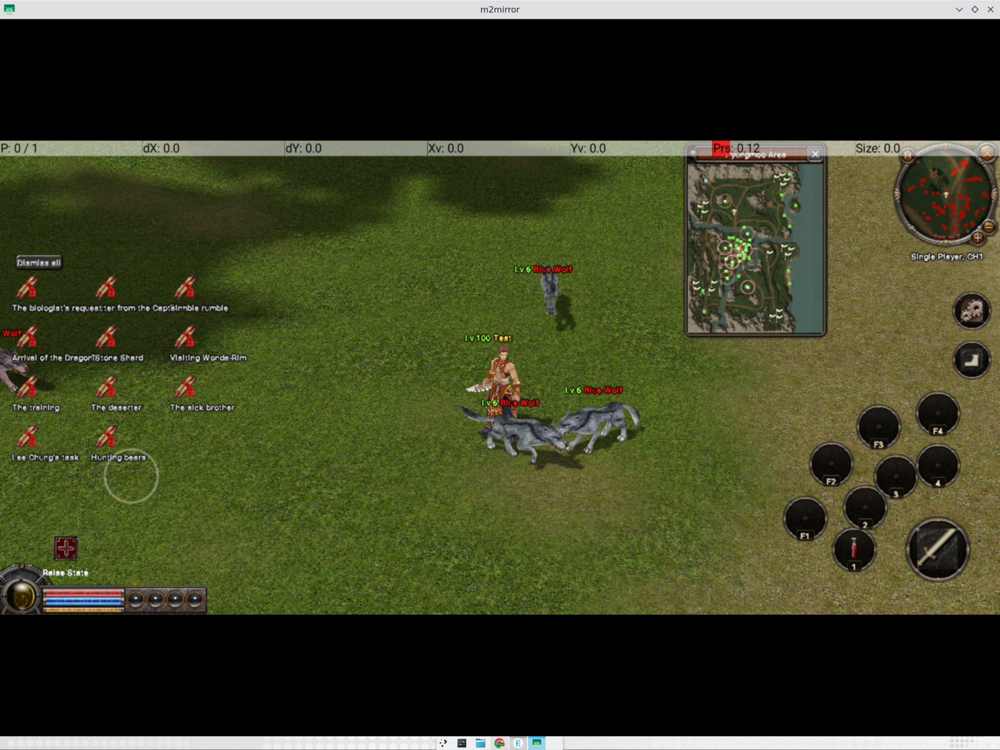
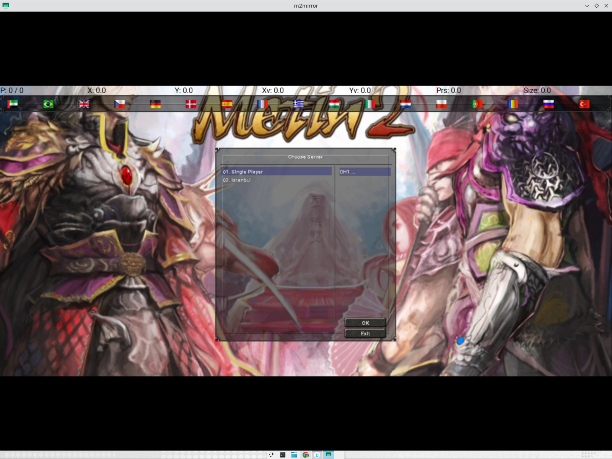

# Metin2 for Android

A native Android client for the classic Metin2 experience, with touch controls, a mobile HUD,
and a bundled Single Player server. The project is delivered as one Android application: users
choose **Single Player** or a remotely hosted server from the in-game server list.



## Current snapshot




### Playable client

- Login, server/channel selection, character selection and world entry.
- Terrain, characters, monsters, NPCs, names, minimap and classic UI.
- Single Player mode with the database, authentication server and channel server embedded in
  the APK.
- Remote server entries loaded from the repository-owned server catalog, with cached refreshes
  so new servers can be added without releasing a new APK.
- Touch movement, tap-to-move, floating joystick, camera drag and two-finger camera zoom.
- Mobile HUD with quick slots, skills, attack, pickup and menu controls.
- Tapping a mob starts auto-attack; the mobile HUD attack button performs one swing per tap.
- Desktop HUD and Mobile HUD can be selected in Settings.
- UI scaling up to 150%, responsive wide inventory layout, portrait mode and adjustable camera
  sensitivity.
- Tap an item or skill in native windows for details; hold to pick it up or move it.
- Equipped items render in the equipment panel and remain persisted across app restarts and
  background/foreground cycles.
- Quest-notice bulk dismissal, chat input and an Android on-screen keyboard.
- Audio playback through the Android backend, with separate music and effects volume controls.

## Getting started

The primary deliverable is the bundled APK. It contains the Android client, game data and the
embedded Single Player server.

For development builds, after the Android toolchain, staged client data and server pack are
available:

```bash
cd "r10dev.net OPENGL-ITJA/android"
VERSION=1
M2_SERVER_PACK=~/m2serverpack tools/make_bundle.sh bundled "$VERSION"
adb install -r "$HOME/m2bundle/metin2-bundled-$VERSION.apk"
```

The build produces one APK with both `arm64-v8a` and `x86_64` native libraries. The app package
is `com.metin2.client.offline`; the in-game label is **Metin2**.

For complete data preparation, server setup, and client connection instructions, see
[docs/SELF_HOSTING.md](docs/SELF_HOSTING.md).

## Architecture

```text
 Platform ports              clientsource/platform/: M2Plat (window, GL present,
                             input, env) and M2Net (byte stream) — the hexagon
        ┌────────────┴────────────┐
 Android adapter              Web adapter
 AndroidMain.cpp: EGL,        platform/web/: canvas, DOM input,
 window attach/detach         Emscripten MEMFS, WebSocket transport
        │                            │
 Game client (C++)  ←── same core ──┘
                             original engine, game logic and Python 2.7 UI scripts
        │                    Win32 API shimmed by android_compat/
        ├── d8gles           D3D8 fixed-function → OpenGL ES 3
        └── OpenGr2ndma      open-source Granny GR2 model/animation runtime
```

The same client also builds for the browser: `web/build.sh` produces
`metin2_web.{js,wasm,html}` (Emscripten + WebGL2), `web/serve.py` hosts it
with the required headers and bridges WebSocket → TCP to the game server.
See [docs/SELF_HOSTING.md](docs/SELF_HOSTING.md) section 5.

The two engine libraries are standalone projects, usable for other old Windows games:

- **[d8gles](https://github.com/cemreefe/d8gles)**: Direct3D 8 on top of OpenGL ES 3.
- **[OpenGr2ndma](https://github.com/cemreefe/OpenGr2ndma)**: an open replacement for the
  Granny 3D runtime.

## Repository layout

- `r10dev.net OPENGL-ITJA/clientsource/` — native client, platform ports and adapters.
- `r10dev.net OPENGL-ITJA/web/` — Emscripten build flags, HTML shell, data
  manifest, static server + ws→tcp bridge, headless test driver.
- `r10dev.net OPENGL-ITJA/android/` — Android application, profiles, packaging and server
  catalog.
- `server/` — server-side integration and setup material.
- `docs/` — self-hosting and project documentation.

## Source projects and data

- Client source: fork of [Bahori35/metin2-android](https://github.com/Bahori35/metin2-android).
- Server source: [d1str4ught/m2dev-server-src](https://github.com/d1str4ught/m2dev-server-src).
- Server runtime/configuration: [d1str4ught/m2dev-server](https://github.com/d1str4ught/m2dev-server).
- Client data is staged separately and is not committed to this repository.
- The server catalog is maintained at
  [`r10dev.net OPENGL-ITJA/android/servers/servers.json`](r10dev.net%20OPENGL-ITJA/android/servers/servers.json).

The current runtime has been verified end-to-end on the x86_64 Android emulator, including
equipped-item rendering, inventory persistence, app swipe-away and immediate relaunch. Physical
arm64 hardware validation remains device-dependent.

## Legal

Metin2 and its art, models and names belong to Webzen/Gameforge. This repository contains no
game data. You supply it yourself, and builds that include it are for private use only. Do not
use modified clients on official servers.
