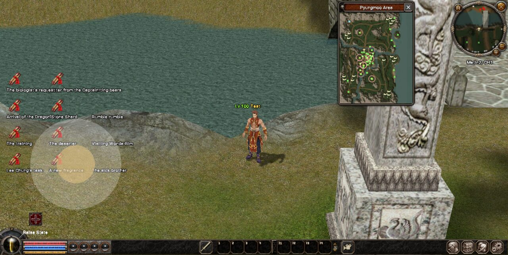
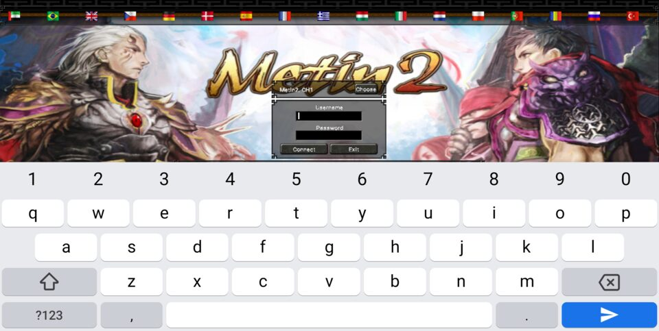
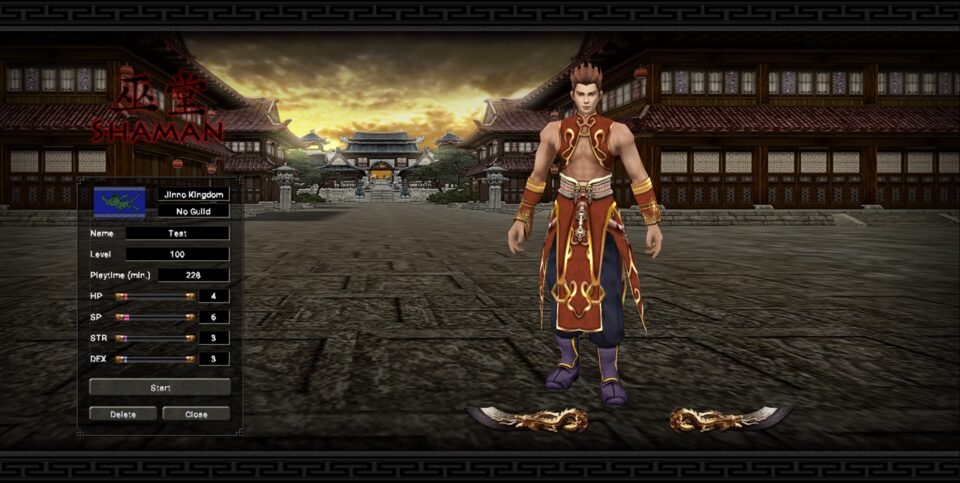
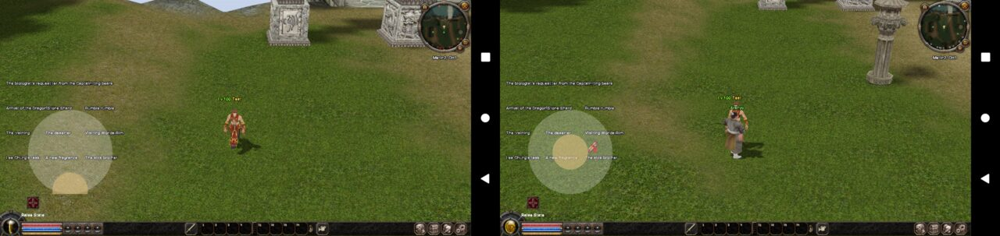

# Metin2 for Android

A native Android port of the classic Metin2 client. It runs on a phone, talks to a real
m2dev server, and can even carry that server inside the APK and play fully offline.



| Login | Character select | Joystick: hold down → walks toward the camera, release → stops |
|---|---|---|
|  |  |  |

*Screenshots are from the x86_64 Android emulator.*

## What works

- **The whole loop:** login → server/channel → character select → world. Terrain, models,
  name tags and the full UI render through a D3D8 → OpenGL ES 3 translation layer.
- **Built for touch:** tap to walk, hold to keep walking or attacking, drag to turn the camera,
  and an on-screen joystick for arrow-key-style movement. The UI is laid out for the phone's
  aspect ratio, so text isn't stretched.
- **Combat:** tap a monster or Metin stone to target it; the taskbar sword's auto-attack
  fights it to the death, and the server confirms each kill.
- **Offline mode:** the `offline-bundled` profile ships the game data *and* the m2dev server
  (db, auth, game core on SQLite instead of MySQL) inside a single APK. It installs next to the
  online client as "Metin2 Offline".
- **Survives real phone use:** switch apps and come back to the same spot. A foreground
  service keeps the session and the local server alive in the background.
- **On-screen keyboard** for chat and login, with the game sliding up so the field stays visible.

Still in progress: loot pickup and rewards, death/respawn, NPC shops, larger custom UI pieces,
and testing on more physical phones. See the [porting diary](docs/PORTING_DIARY.md).

## Get it running

| You want to… | Read |
|---|---|
| Run your own server, prepare game data, build an APK, connect a phone | [docs/SELF_HOSTING.md](docs/SELF_HOSTING.md) |
| Build the single-file offline APK | [docs/SELF_HOSTING.md § 4.4](docs/SELF_HOSTING.md#44-fully-offline-apk-embedded-server) |
| Understand how the port works / port to another platform | [docs/PORTING_DIARY.md](docs/PORTING_DIARY.md) |

Quick version, once the toolchain, staged data and server pack are in place:

```bash
cd "r10dev.net OPENGL-ITJA/android"
M2_SERVER_PACK=~/m2serverpack tools/make_bundle.sh offline-bundled 1
adb install -r ~/m2bundle/metin2-offline-1.apk
```

Every setup (LAN server, tunnel, emulator, offline) is a small `profiles/*.properties` file,
so you switch setups by picking a profile, not by editing code.

## How it's built

```
 Android shell (Java)        activity/surface lifecycle, touch, joystick, keyboard,
                             data unpacking, embedded-server launcher, foreground service
        │ JNI
 Platform adapter (C++)      AndroidMain.cpp: EGL, window attach/detach, input → engine events
        │
 Game client (C++)           original engine, game logic and Python 2.7 UI scripts
        │                    Win32 API shimmed by android_compat/
        ├── d8gles           D3D8 fixed-function → OpenGL ES 3
        └── OpenGr2ndma      open-source Granny GR2 model/animation runtime
```

The two engine libraries are standalone projects, usable for other old Windows games:

- **[d8gles](https://github.com/cemreefe/d8gles)**: Direct3D 8 on top of OpenGL ES 3.
- **[OpenGr2ndma](https://github.com/cemreefe/OpenGr2ndma)**: an open replacement for the Granny 3D runtime.

## Sources

| Part | From |
|---|---|
| Client source | fork of [Bahori35/metin2-android](https://github.com/Bahori35/metin2-android) |
| Server | [d1str4ught/m2dev-server-src](https://github.com/d1str4ught/m2dev-server-src) + [m2dev-server](https://github.com/d1str4ught/m2dev-server) |
| Client data | [d1str4ught/m2dev-client](https://github.com/d1str4ught/m2dev-client), never committed here |

Exact pinned revisions are listed in the self-hosting guide.

## Legal

Metin2 and its art, models and names belong to Webzen/Gameforge. This repository contains no
game data. You supply it yourself, and builds that include it are for private use only. Don't
use modified clients on official servers.
